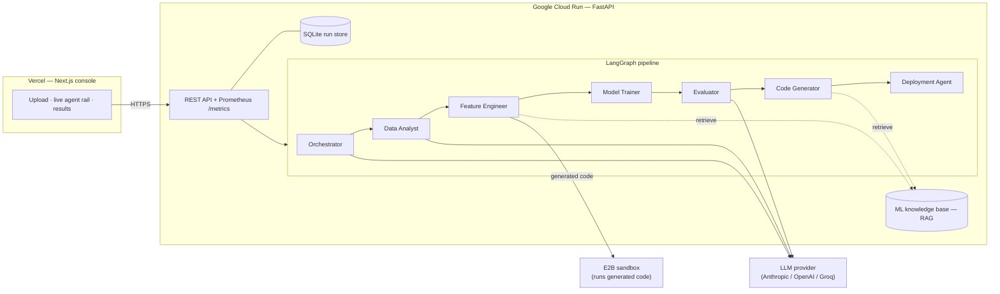

# Autonomous ML Pipeline Builder

**Upload a CSV, describe your problem in plain English, and a team of AI agents builds, evaluates, and packages a complete, deployable ML pipeline — live.**

[](https://github.com/shiva-shivanibokka/Autonomous-ML-Pipeline-Builder/actions/workflows/ci.yml)


> ### Recruiter TL;DR
> - **What it is:** a full-stack AI system that turns a raw CSV + a plain-English goal into a trained, SHAP-explained, deployment-ready ML model — built end to end by a 7-agent LangGraph crew, with a Next.js console that streams every agent's work in real time.
> - **Hardest problem solved:** eliminating train/test **data leakage** across the whole flow (preprocessing is a scikit-learn `Pipeline` fit on the training fold only) *and* shipping a **runnable** artifact — the full pipeline serializes to `model.pkl`, so the generated FastAPI service predicts on raw input with zero training/serving skew.
> - **Production concerns are addressed, not gestured at:** 45 automated tests (CI-green), structured JSON logging + Prometheus metrics, security hardening (no arbitrary file reads, sandboxed code execution, keys never stored), and a Cloud Run + Vercel deployment path with a documented runbook.

A LangGraph crew of seven agents plans the approach, profiles the data, engineers leakage-safe features, trains and cross-validates several models in parallel, explains the winner with SHAP, and emits a runnable FastAPI + Docker inference bundle. A Next.js console streams every agent's work in real time.

> **Live demo:** not yet deployed — the deployment path (Cloud Run + Vercel) is fully configured with a step-by-step runbook in [deploy/README.md](deploy/README.md). Add demo URLs here once live.

---

## Why this project is interesting

Most early-career ML projects are a notebook with a model that was never deployed and quietly leaks test data into training. This one is built the other way around:

- **No data leakage.** Preprocessing is a scikit-learn `Pipeline` fit on the training fold only, validated with k-fold cross-validation. ([ADR 0002](docs/adr/0002-leakage-safe-pipeline.md))
- **The output actually runs.** The winning pipeline (preprocessing + model) is serialized to `model.pkl`; the generated FastAPI service loads it and predicts on raw input — no training/serving skew.
- **Built to deploy properly.** Non-root container for Cloud Run, static frontend for Vercel, secrets via Secret Manager, health checks, structured logs, and a Prometheus `/metrics` endpoint. (Config and runbook are in the repo; not yet stood up live.)
- **Retrieval-grounded agents.** The code-generating agents retrieve from a curated ML best-practices knowledge base (RAG) instead of relying on parametric memory alone.
- **Hardened.** No arbitrary file reads, generated code never runs on the host in production (isolated E2B sandbox), API keys are never stored, CORS is locked down, and the app refuses to boot if production is misconfigured.

## Architecture



**Why this shape?** The UI and the pipeline have opposite runtime profiles — static assets updated often vs. multi-minute stateful jobs that spawn sandboxed work. Serverless functions can't host the latter (they time out and don't hold state), so the backend is a long-lived Cloud Run container and the frontend is a Vercel static app; they talk over HTTPS with a locked-down CORS contract. Full reasoning in [ADR 0001](docs/adr/0001-frontend-backend-split.md).

## The seven agents

| # | Agent | What it does |
|---|-------|--------------|
| 1 | **Orchestrator** | Detects task type (classification / regression / time series), picks the models and primary metric. |
| 2 | **Data Analyst** | Profiles the dataset — dtypes, missing values, class imbalance, outliers. |
| 3 | **Feature Engineer** | Generates & runs leakage-safe structural preprocessing in a sandbox; self-corrects on failure. |
| 4 | **Model Trainer** | Trains 3–5 models **in parallel** (`asyncio`), each as a leakage-safe pipeline with k-fold CV. |
| 5 | **Evaluator** | Deterministically selects the winner, runs SHAP on the held-out test set, flags fairness risks, persists `model.pkl`. |
| 6 | **Code Generator** | Writes a clean, documented `pipeline.py`. |
| 7 | **Deployment Agent** | Emits a FastAPI inference endpoint, Dockerfile, and OpenAPI spec. |

A **self-correction loop** wraps sandboxed execution: when generated code fails, the traceback is fed back to the LLM to fix it (up to 3 attempts).

## Skills demonstrated

Real capabilities exercised in this repo (mapped to how they're usually named), with where to find each:

| Competency | In this repo |
|---|---|
| **LLM application development · RAG · agentic systems** | 7-node LangGraph orchestration (`agents/`), TF-IDF/embedding retrieval grounding (`core/rag/`), self-correction loop (`sandbox/`) |
| **Production ML / MLOps** | Serving decoupled from training, full-pipeline persistence (`model.pkl`), MLflow tracking (`core/mlops/`) |
| **Data engineering / ETL** | Raw CSV → profiled → leakage-safe feature pipeline → model-ready (`agents/data_analyst.py`, `agents/model_trainer.py`) |
| **RESTful API design** | FastAPI service with upload/run/status/logs/result/artifacts endpoints (`api/`) |
| **Asynchronous / concurrent systems** | Parallel model training via `asyncio`, background run workers via a thread pool |
| **System design & architecture** | Two ADRs documenting the split and the leakage fix (`docs/adr/`) |
| **Observability & monitoring** | Structured JSON logging (structlog), health check, Prometheus `/metrics` |
| **Application security** | Server-issued upload IDs (no arbitrary file read), sandboxed execution, no stored keys, CORS allowlist, fail-loud prod boot |
| **Containerization & CI/CD** | Non-root Dockerfile, GitHub Actions (lint + test + frontend build) |
| **Cloud-native deployment (GCP Cloud Run · Vercel)** | Deploy script + runbook (`deploy/`) — configured, not yet live |
| **Automated testing** | 45 pytest tests incl. security, ML-correctness, and RAG-quality checks (`tests/`) |
| **Frontend engineering** | Next.js (App Router) + TypeScript console with live streaming (`web/`) |

## Tech stack

**Backend** — Python 3.11 · FastAPI · LangGraph · LangChain · scikit-learn · LightGBM · XGBoost · SHAP · MLflow · E2B · Pydantic v2 · Prometheus · structlog
**Frontend** — Next.js (App Router) · TypeScript · Tailwind CSS
**Infra** — Docker · Google Cloud Run · Vercel · GitHub Actions

Exact pinned versions are in [`requirements.txt`](requirements.txt) and [`web/package.json`](web/package.json).

## Getting started (local)

**Prerequisites:** Python 3.11, Node 20+, and an LLM API key (Anthropic / OpenAI / Groq).

### Backend

```bash
cp .env.example .env            # add your API key(s)
pip install -r requirements-dev.txt

# Local dev: run generated code in a subprocess sandbox (E2B not required locally).
export ALLOW_LOCAL_EXEC=true EXECUTION_BACKEND=subprocess
uvicorn api.main:app --reload --port 8000
# Interactive API docs: http://localhost:8000/docs
```

> Security note: `ALLOW_LOCAL_EXEC=true` runs LLM-generated code on your machine and is for **local dev only**. In production the app requires an [E2B](https://e2b.dev) sandbox key and refuses to boot otherwise.

### Frontend

```bash
cd web
cp .env.local.example .env.local   # defaults to http://localhost:8000
npm install
npm run dev                        # http://localhost:3000
```

Open http://localhost:3000, drop in a CSV, describe the goal, and watch the agents run.

> **Full Docker stack** (API + MLflow tracking server): `docker-compose up --build`.

## Usage (API)

The frontend drives these; you can also call them directly:

```bash
# 1. Upload a CSV — returns an opaque upload_id (never a filesystem path)
curl -F "file=@data.csv" http://localhost:8000/upload

# 2. Start a run
curl -X POST http://localhost:8000/pipeline/run \
  -H "Content-Type: application/json" \
  -d '{"upload_id":"<id>","business_problem":"Predict the target column",
       "provider":"anthropic","api_key":"sk-...","model_name":""}'

# 3. Poll status / stream logs, then fetch results and artifacts
curl http://localhost:8000/pipeline/<pipeline_id>/status
curl http://localhost:8000/pipeline/<pipeline_id>/logs
curl -O http://localhost:8000/pipeline/<pipeline_id>/artifacts/model.pkl
```

## Testing

```bash
pip install -r requirements-dev.txt
ALLOW_LOCAL_EXEC=true pytest -q          # 45 tests
ruff check .                             # lint
```

CI runs the same lint + tests (with coverage) plus the frontend build on every push and PR ([`.github/workflows/ci.yml`](.github/workflows/ci.yml)). Coverage spans the API security contract (arbitrary-path rejection, key redaction), the leakage-safe training + persistence path, deterministic model selection, RAG retrieval quality, and the run store.

## Project structure

```
agents/        # the seven LangGraph nodes
pipeline/      # graph wiring + run entry points (blocking, streaming)
core/          # config, LLM providers, MLflow tracking, RAG retriever, run store
sandbox/       # E2B / subprocess execution with a self-correction loop
api/            # FastAPI app + schemas
knowledge/     # ML best-practices corpus (RAG source)
web/           # Next.js frontend (deploys to Vercel)
deploy/        # Cloud Run deploy script + runbook
docs/adr/      # architecture decision records
tests/         # pytest suite
```

## Deployment

Not yet deployed. The path is fully configured: backend → Cloud Run (non-root `Dockerfile`), frontend → Vercel (`web/`). Step-by-step runbook — secrets, env, CORS wiring, rollback — in **[deploy/README.md](deploy/README.md)**. Remaining tasks are tracked in [TODO.md](TODO.md).

## Roadmap / known limitations

- **State durability:** the run store (SQLite) and artifacts are per-instance and reset on a Cloud Run cold start — fine for a demo. The `RunStore` interface is intentionally small to swap in Postgres/Redis + object storage.
- **Cross-validation** is capped by a row threshold to keep demo runs fast; larger datasets skip CV and say so in the log.
- **Hyperparameters** are fixed per model — an Optuna tuning pass is a natural next addition.
- Full task list in [TODO.md](TODO.md).

## License

MIT — see [LICENSE](LICENSE).
