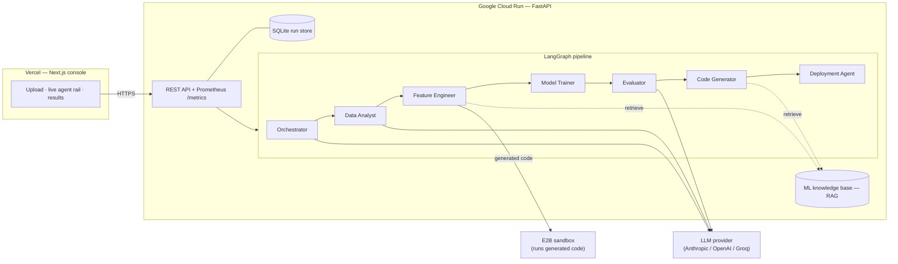

# Autonomous ML Pipeline Builder

**Upload a CSV, describe your problem in plain English, and a team of AI agents builds, evaluates, and packages a complete, deployable ML pipeline — live.**

A LangGraph crew of seven agents plans the approach, profiles the data, engineers leakage-safe features, trains and cross-validates several models in parallel, explains the winner with SHAP, and emits a runnable FastAPI + Docker inference bundle. A Next.js console streams every agent's work in real time.

<p>
  
  
  
  
</p>

> **Live demo:** frontend on Vercel · backend on Cloud Run — _add your URLs here_

---

## Why this project is interesting

Most student ML projects are a notebook with a model that was never deployed, and quietly leak test data into training. This one is built the other way around:

- **No data leakage.** Preprocessing is a scikit-learn `Pipeline` fit on the training fold only, validated with k-fold cross-validation. ([ADR 0002](docs/adr/0002-leakage-safe-pipeline.md))
- **The output actually runs.** The winning pipeline (preprocessing + model) is serialized to `model.pkl`; the generated FastAPI service loads it and predicts on raw input — no training/serving skew.
- **Deployed for real.** Container on Cloud Run, static frontend on Vercel, secrets in Secret Manager, health checks, structured logs, and a Prometheus `/metrics` endpoint.
- **Retrieval-grounded agents.** The code-generating agents retrieve from a curated ML best-practices knowledge base (RAG) instead of relying on parametric memory alone.
- **Hardened.** No arbitrary file reads, generated code never runs on the host in production (isolated E2B sandbox), API keys are never stored, CORS is locked down, and the app refuses to boot if production is misconfigured.

## Architecture



The frontend and backend deploy independently and talk over HTTPS ([ADR 0001](docs/adr/0001-frontend-backend-split.md)).

## The seven agents

| # | Agent | What it does |
|---|-------|--------------|
| 1 | **Orchestrator** | Detects task type (classification / regression / time series), picks the models and primary metric. |
| 2 | **Data Analyst** | Profiles the dataset — dtypes, missing values, class imbalance, outliers. |
| 3 | **Feature Engineer** | Generates & runs leakage-safe structural preprocessing in a sandbox; self-corrects on failure. |
| 4 | **Model Trainer** | Trains 3–5 models **in parallel**, each as a leakage-safe pipeline with k-fold CV. |
| 5 | **Evaluator** | Deterministically selects the winner, runs SHAP on the held-out test set, flags fairness risks, persists `model.pkl`. |
| 6 | **Code Generator** | Writes a clean, documented `pipeline.py`. |
| 7 | **Deployment Agent** | Emits a FastAPI inference endpoint, Dockerfile, and OpenAPI spec. |

## Tech stack

**Backend** — Python · FastAPI · LangGraph · LangChain · scikit-learn · LightGBM · XGBoost · SHAP · MLflow · E2B · Pydantic v2 · Prometheus · structlog
**Frontend** — Next.js (App Router) · TypeScript · Tailwind CSS
**Infra** — Docker · Google Cloud Run · Vercel · GitHub Actions

## Quickstart (local)

**Prerequisites:** Python 3.11, Node 20+, and an LLM API key (Anthropic / OpenAI / Groq).

### Backend

```bash
cp .env.example .env            # add your API key(s)
pip install -r requirements-dev.txt

# Local dev: run generated code in a subprocess sandbox (E2B not required).
export ALLOW_LOCAL_EXEC=true EXECUTION_BACKEND=subprocess
uvicorn api.main:app --reload --port 8000
# API docs at http://localhost:8000/docs
```

### Frontend

```bash
cd web
cp .env.local.example .env.local   # defaults to http://localhost:8000
npm install
npm run dev                        # http://localhost:3000
```

Open http://localhost:3000, drop in a CSV, describe the goal, and watch the agents run.

> **Full Docker stack** (API + MLflow tracking server): `docker-compose up --build`.

## Tests

```bash
pip install -r requirements-dev.txt
ALLOW_LOCAL_EXEC=true pytest -q          # 45 tests
ruff check .                             # lint
```

Coverage spans the API security contract (arbitrary-path rejection, key redaction), the leakage-safe training + persistence path, deterministic model selection, RAG retrieval quality, and the run store.

## Deployment

Backend → Cloud Run, frontend → Vercel. Full runbook (secrets, env, rollback) in **[deploy/README.md](deploy/README.md)**.

## Project structure

```
agents/        # the seven LangGraph nodes
pipeline/      # graph wiring + run entry points (blocking, streaming)
core/          # config, LLM providers, MLflow tracking, RAG retriever, run store
sandbox/       # E2B / subprocess execution with a self-correction loop
api/            # FastAPI app + schemas
knowledge/     # ML best-practices corpus (RAG source)
web/           # Next.js frontend (deploys to Vercel)
deploy/        # Cloud Run deploy script + runbook
docs/adr/      # architecture decision records
```

## Known limitations & next steps

- Run state (SQLite) and artifacts are per-instance and reset on a Cloud Run cold start — fine for a demo; the `RunStore` interface is small so it swaps to Postgres/Redis + object storage for durability.
- Cross-validation is capped by a row threshold to keep demo runs fast; large datasets skip CV (and say so in the log).
- Hyperparameters are fixed per model — a tuning pass (Optuna) is a natural next addition.

## License

MIT — see [LICENSE](LICENSE).
